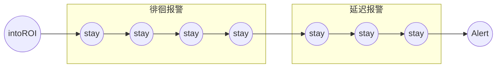
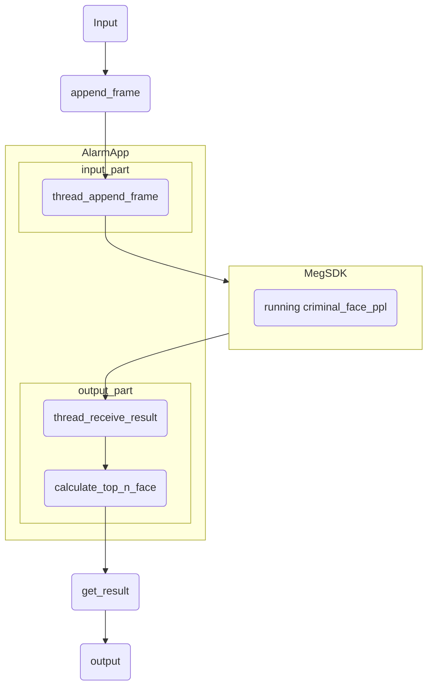

```mermaid
flowchart LR
    Before((intoROI))-->A
    subgraph 徘徊报警
    A((stay))-->B((stay))-->C((stay))-->D((stay))
    end
    subgraph 延迟报警
    D-->E((stay))-->F((stay))-->G((stay))
    end
    G-->Alert((Alert))
    
```

```mermaid
flowchart TB
    Input(Input) --> append_frame(append_frame)
    append_frame --> thread_append_frame
    subgraph AlarmApp
        input_part 
        output_part
    end
    subgraph input_part
    thread_append_frame(thread_append_frame)
    end
    thread_append_frame --> MegSDK
    subgraph MegSDK
        SDK(running criminal_face_ppl)
    end
    MegSDK --> thread_receive_result

    subgraph output_part
    thread_receive_result(thread_receive_result) --> Calculate(calculate_top_n_face) 
    end
    Calculate -->get_result(get_result)
    get_result --> output(output)
```
