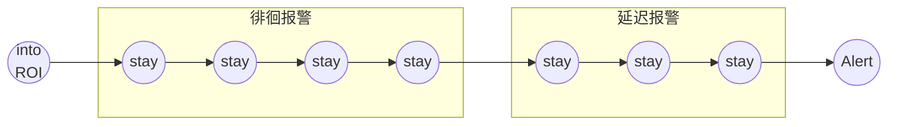
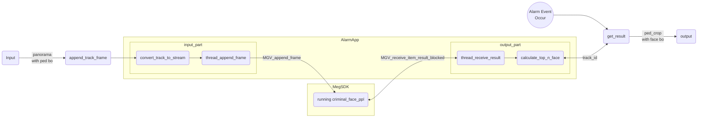

```mermaid
flowchart LR
    Before((into<br>ROI))-->A
    subgraph 徘徊报警
    A((stay))-->B((stay))-->C((stay))-->D((stay))
    end
    subgraph 延迟报警
    D-->E((stay))-->F((stay))-->G((stay))
    end
    G-->Alert((Alert))
    
```

```mermaid
flowchart LR
    Input(Input) --panorama<br>with ped box--> append_track_frame(append_track_frame)
    append_track_frame --> convert_track_to_stream
    subgraph AlarmApp
        input_part 
        output_part
    end
    subgraph input_part
    convert_track_to_stream(convert_track_to_stream) -->thread_append_frame
    thread_append_frame(thread_append_frame)
    end
    thread_append_frame --MGV_append_frame--> SDK
    subgraph MegSDK
        SDK(running criminal_face_ppl)
    end
    SDK <--MGV_receive_item_result_blocked--> thread_receive_result

    subgraph output_part
    thread_receive_result(thread_receive_result) --> Calculate(calculate_top_n_face) 
    end
    AsyncCall((Alarm Event<br>Occur))-->get_result
    Calculate <--track_id-->get_result(get_result)
    get_result --ped_crop<br>with face box--> output(output)
```
